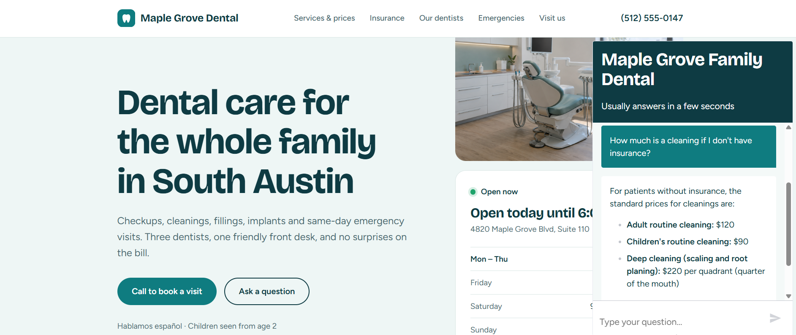
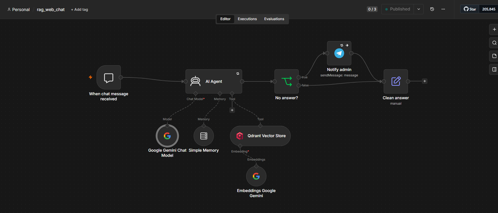

# AI Support Bot with a Company Knowledge Base (RAG)

An AI assistant that answers customer questions using **the company's own documents** — prices, services, insurance, opening hours, policies — instead of the model's general knowledge. When the answer is not in the knowledge base, the bot says so honestly and forwards the question to a human, so no lead is lost.

Built with n8n. The same knowledge base serves **two channels**: a chat widget on a website and a Telegram bot.

**→ Live demo: [maple-grove-dental-demo.ertrain982.workers.dev](https://maple-grove-dental-demo.ertrain982.workers.dev)** — a demo website of a fictional dental clinic. Open the chat in the bottom-right corner and ask anything about prices, insurance or office hours.



## What it does

- Answers in the customer's own language — ask in English, Spanish or Russian and the reply comes back in that language
- Answers only from the uploaded documents, so it never invents a price or a policy
- Escalates unknown questions to the business owner in real time, with the customer's question attached
- Remembers the last 10 messages of the conversation, so follow-up questions work
- New knowledge base = new business: replace the PDF and the same bot serves a clinic, a law firm or a store

## Stack

n8n · Google Gemini (chat + embeddings) · Qdrant vector database · Telegram Bot API · Google Sheets

## How it works



**1. Knowledge base ingestion** (`workflows/rag_ingestion_dental.json`)
A PDF is uploaded through a web form. The text is extracted, split into 1000-character chunks with a 200-character overlap, converted into vectors by Gemini and stored in Qdrant. Each chunk keeps its source file name and upload date as metadata.

**2. The assistant** (`workflows/rag_web_chat.json`)
A visitor writes in the website chat. An AI agent on Gemini runs a semantic search over Qdrant, and answers strictly from what the search returns. If nothing relevant is found, the agent returns a service marker, the visitor gets a polite fallback message and the owner gets a Telegram notification with the original question.

**3. Telegram channel** (`workflows/rag_bot.json`, `workflows/rag_ingestion.json`)
The same architecture wired to Telegram instead of a website, plus two extras: every conversation is logged to Google Sheets, and a scheduled branch follows up with customers who went quiet for three days.

## Technical decisions worth noting

- **"No answer" is a marker, not a phrase.** The agent starts the message with `[NO_ANSWER]` instead of writing "I don't know". Matching on a phrase breaks the moment the model rephrases itself.
- **Dates are generated in n8n**, not by the model. An LLM has no access to the current date and will confidently make one up.
- **The search tool is mandatory in the system prompt.** Lightweight models will happily answer "I don't know" without ever calling the tool unless they are explicitly told to search first.
- **Retries and continue-on-error on every outbound node.** Gemini returns HTTP 503 under load and customers block bots; neither should break the chain.
- **The answer is cleaned in a separate node**, so the marker never reaches the customer and an empty response falls back to a readable message.

## Run it yourself

1. Import the workflows from `workflows/` into n8n.
2. Add credentials: Google Gemini (API key), Qdrant, and Telegram if you want notifications.
3. In `Notify admin`, replace `YOUR_ADMIN_CHAT_ID` with your Telegram chat ID.
4. Run the ingestion workflow and upload a PDF — `knowledge-base/` has the demo one.
5. Publish `rag_web_chat` and take the chat URL from the trigger node.
6. To embed the widget in a site, see `site/index.html`: it loads `@n8n/chat` and points it at that URL.

## Repository

```
workflows/       n8n workflows: web chat, Telegram bot, both ingestion flows
site/            demo clinic website with the embedded chat widget
knowledge-base/  demo PDF used by the live demo
docs/            screenshots
```

The demo clinic, its prices and its contact details are fictional.

Russian version of this document: [README.ru.md](README.ru.md)
